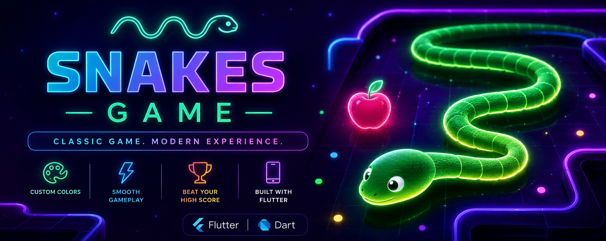
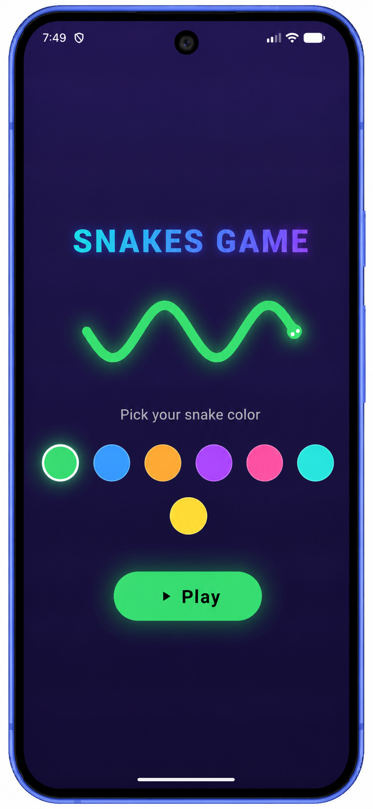
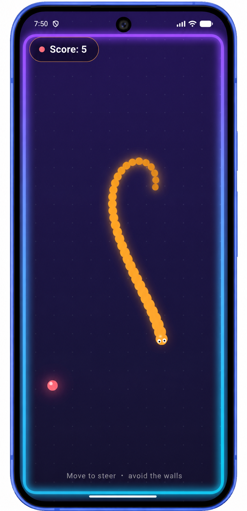

<div align="center">

# 🐍 Snakes Game

### A modern neon-themed Snake Game built with Flutter & Dart

<p>

</p>


</div>

---

# 📖 About

Snakes Game is a modern reimagining of the classic Snake arcade game, built entirely with Flutter and Dart.

Unlike traditional snake games, this version features a neon-inspired UI, smooth animations, customizable snake colors, glowing visual effects, and an immersive gameplay experience.

The player controls a continuously moving snake, collects food to increase the score, avoids collisions with walls and its own body, and aims to achieve the highest possible score.

---

# ✨ Features

- 🎨 7 selectable snake colors
- ✨ Beautiful neon glow UI
- 🌌 Dark futuristic game theme
- 🎮 Smooth gameplay mechanics
- 🍎 Dynamic food spawning
- 📈 Live score tracking
- 💀 Game Over screen
- 🔄 Instant replay
- 📱 Responsive Flutter interface

---

# 📱 Screenshots

## Home Screen

<p align="center">

</p>

---

## Gameplay

<p align="center">


</p>

---

## Game Over

<p align="center">

</p>

---

# 🚀 Getting Started

## Prerequisites

- Flutter SDK
- Android Studio / VS Code
- Android Emulator or Physical Device

---

## Installation

Clone the repository

```bash
git clone https://github.com/Keshav7m/snakes_game.git
```

Go into the project

```bash
cd snakes_game
```

Install packages

```bash
flutter pub get
```

Run the application

```bash
flutter run
```

---

# 🎮 How to Play

- Select your favorite snake color.
- Press **Play**.
- Eat food to increase your score.
- Avoid hitting the walls.
- Avoid colliding with your own body.
- Try to beat your highest score.

---

# 🛠 Built With

- Flutter
- Dart
- Material Design

---

# 📂 Project Structure

```
lib/
 ├── main.dart
```

---

# 👨‍💻 Author

**Keshav Mittal**

GitHub

https://github.com/Keshav7m

---

# ⭐ Support

If you enjoyed this project,

⭐ Star the repository

It really helps and motivates future development.

---
