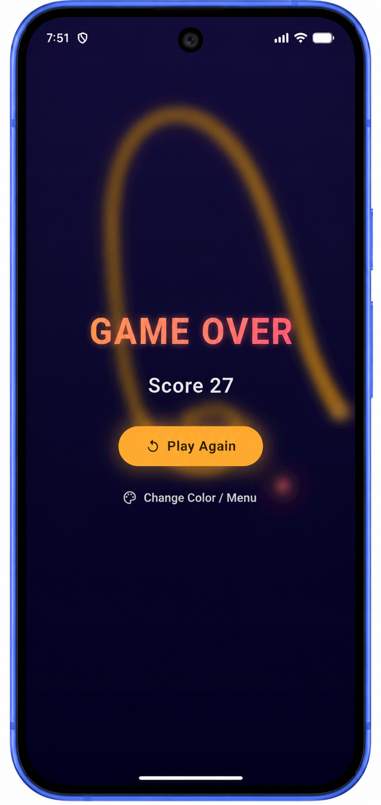

<div align="center">


# 🐍 Snakes Game

### A Modern Neon-Themed Snake Game built with Flutter & Dart

[](https://flutter.dev/)
[
](https://dart.dev/)


A visually modern recreation of the classic Snake Game featuring neon aesthetics, smooth gameplay, customizable snake colors, and responsive controls.

</div>

---

# 📖 About

**Snakes Game** is a modern implementation of the classic Snake arcade game developed using **Flutter** and **Dart**.

The project combines nostalgic gameplay with a contemporary neon-inspired interface, smooth animations, glowing visual effects, and customizable snake colors to create an engaging mobile gaming experience.

Players control a continuously moving snake, collect food to increase their score, and survive as long as possible while avoiding collisions with the arena boundaries.

---

# ✨ Features

- 🎮 Classic Snake gameplay
- 🌈 Seven selectable snake colors
- ✨ Neon glow visual effects
- 🎨 Modern dark UI
- ⚡ Smooth animations
- 🍎 Dynamic food spawning
- 📈 Live score tracking
- 💀 Game Over screen
- 🔄 One-tap replay
- 📱 Responsive Flutter interface

---

# 📱 Screenshots

## Home Screen

<p align="center">

</p>

---

## Gameplay

<p align="center">

</p>

---

## Game Over

<p align="center">

</p>

---

# 🚀 Tech Stack

| Technology | Version |
|------------|---------|
| Flutter | **3.44.7** |
| Dart | **3.12.2** |
| IDE | VS Code |
| Platform | Android |

---

# 📂 Project Structure

```text
snakes_game
│
├── android
├── ios
├── lib
│   └── main.dart
├── screenshots
│   ├── banner.png
│   ├── gameplay.png
│   ├── home.png
│   └── over.png
├── test
├── web
├── windows
├── pubspec.yaml
└── README.md
```

---

# 🚀 Getting Started

## Clone the Repository

```bash
git clone https://github.com/Keshav7m/snakes_game.git
```

Move into the project directory

```bash
cd snakes_game
```

Install dependencies

```bash
flutter pub get
```

Run the application

```bash
flutter run
```

---

# 🎮 How to Play

1. Launch the application.
2. Select your preferred snake color.
3. Press **Play**.
4. Collect glowing food to increase your score.
5. Avoid touching the arena boundaries.
6. Try to achieve the highest possible score.

---

# 📌 Future Improvements

- High Score persistence
- Background music
- Sound effects
- Difficulty levels
- Obstacles
- Pause / Resume
- Leaderboard
- Haptic feedback
- Achievement system

---

# 👨‍💻 Author

### Keshav Mittal

Bioinformatics Undergraduate | Flutter Developer | Machine Learning Enthusiast

GitHub: https://github.com/Keshav7m

---

# ⭐ Show your support

If you enjoyed this project,

please consider giving it a ⭐ on GitHub.

It helps others discover the project and motivates future development.

---

<div align="center">

Made with ❤️ using Flutter

</div>
